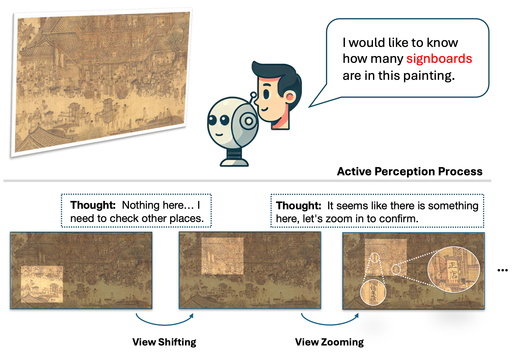

# ActiView: Evaluating Active Perception Ability for Multimodal Large Language Models

<p align="center"></p>

<div align="center">
    <a href="https://wangphoebe.github.io/actiview_homepage/">🌐<strong>Homepage</strong></a> | <a href="https://arxiv.org/abs/2410.04659">📖<strong>arXiv</strong></a>
</div>

  
## Timeline

📢 [2024-10-23] Benchmark and evaluation toolkit (will be updated soon, does not support single-image models) released.

📢 [2024-10-14] Homepage released.

📢 [2024-10-07] Paper and repo released.  

## Project Overview
This repository contains all the necessary materials, including:
- **Datasets** for active perception evaluation
- **Toolkits** for model evaluation
- **Results** and analysis from the paper

## Leaderboard

### Results of Zooming and Shifting Pipelines

The evaluation of active perception abilities on our benchmark, including zooming, and shifting. "Model AVG": average scores of column "Zooming", "Shifting-R", "Shifting-E", "Shifting-M", and "Shifting-H". 

#### Proprietary Models

| Models            | Full Image | Zooming | Single View | Shifting-R | Shifting-E | Shifting-M | Shifting-H | Model AVG |
|-------------------|------------|---------|-------------|------------|------------|------------|------------|-----------|
| Gemini-1.5-pro | **73.85**  | **72.31**| 58.15       | **67.08**  | **67.38**  | **65.54**  | **67.69**  | **68.00** |
| GPT-4o            | 67.38      | 68.62   | **61.23**   | 67.08      | 66.77      | 65.23      | 64.31      | 66.40     |
| Claude 3.5 Sonnet | 72.92      | 71.69   | 54.46       | 65.23      | 66.15      | 60.31      | 61.85      | 65.05     |

#### Open-source Models for Multiple Images as Input

| Models                  | Full Image | Zooming | Single View | Shifting-R | Shifting-E | Shifting-M | Shifting-H | Model AVG |
|-------------------------|------------|---------|-------------|------------|------------|------------|------------|-----------|
| Qwen2-VL                | 63.08      | 64.62   | 54.46       | 61.23      |  **62.77** |  **64.31** |  **61.85** | **62.96** |
| Idefics3-8B-Llama3       | 59.08      | 58.15   | 53.23       | **61.85** | 59.38      | 59.69      | 60.31      | 59.88     |
| MiniCPM-V 2.6           | 64.62      | 61.85   | 54.46       | 54.77      | 61.23      | 58.15      | 55.69      | 58.34     |
| mPLUG-Owl3              | 62.46      | 60.92   | 54.15       | 51.69      | 56.31      | 55.69      | 53.54      | 55.63     |
| LLaVA-OneVision         | **64.92** | **65.23**|  **56.92**  | 53.54      | 57.23      | 52.31      | 48.62      | 55.39     |
| InternVL2-8B            | 58.15      | 56.00   | 45.85       | 54.77      | 59.70      | 53.23      | 52.00      | 55.14     |
| Mantis                  | 59.08      | 60.62   | 52.92       | 52.92      | 55.38      | 52.92      | 52.31      | 54.83     |
| Idefics2-8B             | 61.85      | 61.85   | 55.69       | 53.23      | 56.92      | 51.69      | 49.23      | 54.58     |
| Brote-IM-XL-3B          | 54.77      | 54.46   | 55.69       | 51.38      | 51.08      | 52.62      | 47.69      | 51.45     |
| Idefics2-8B-base        | 52.62      | 48.62   | 47.69       | 49.54      | 50.77      | 47.69      | 47.69      | 48.86     |
| Brote-IM-XXL-11B        | 53.85      | 54.77   | 49.23       | 49.85      | 50.77      | 44.92      | 43.69      | 48.80     |
| MMICL-XXL-11B           | 51.69      | 49.54   | 50.15       | 49.85      | 49.85      | 46.77      | 45.54      | 48.31     |
| MMICL-XL-3B             | 49.85      | 49.85   | 44.31       | 44.92      | 48.92      | 45.85      | 44.31      | 46.77     |

#### Open-source Models for Single Image as Input

| Models                  | Full Image | Zooming | Single View | Shifting-R | Shifting-E | Shifting-M | Shifting-H | Model AVG |
|-------------------------|------------|---------|-------------|------------|------------|------------|------------|-----------|
| MiniCPM-Llama3-V-2.5    | 63.87      | 61.25   | **54.47**| **60.92**| 60.31      | **59.38**| **58.46**| **60.06**|
| GLM-4V-9B               | **67.08**| 56.92   | 53.85       | 56.92      | **60.62**| 56.00      | 52.92      | 56.68     |
| InternVL-Vicuna-13B     | 56.92      | 62.77   | 52.31       | 53.85      | 52.92      | 52.92      | 51.08      | 54.71     |
| LLaVA-1.6 7B            | 55.08      | **68.92**| 50.15       | 51.69      | 52.31      | 49.23      | 48.00      | 54.03     |
| InternVL-Vicuna-7B      | 55.38      | 65.23   | 51.70       | 52.92      | 51.38      | 50.77      | 48.62      | 53.78     |
| LLaVA-1.6 13B           | 56.92      | 65.23   | 52.31       | 45.85      | 55.08      | 52.62      | 48.92      | 53.54     |
| InternVL-Vicuna-13B-448px| 50.46      | 57.85   | 45.54       | 48.31      | 48.31      | 48.92      | 48.92      | 50.46     |
| mPLUG-Owl2-7B           | 55.08      | 55.38   | 52.00       | 47.38      | 46.46      | 46.46      | 46.15      | 48.37     |
| Mini-Gemini-7B-HD       | 55.69      | 34.77   | 51.70       | 48.62      | 48.00      | 47.69      | 50.15      | 45.85     |
| SEAL                    | 48.31      | 54.77   | 42.77       | 42.15      | 42.77      | 40.02      | 40.62      | 44.07     |
| Mini-Gemini-7B          | 47.08      | 17.85   | 47.38       | 39.38      | 38.15      | 38.15      | 36.00      | 33.91     |

### Results of Mixed Pipeline for Multi-Image Models

**ACC**: accuracy; **\#zoom**: average zooming operations; **\#shift**: average shifting operations; **\#view**: average used views.

|   Models   | ACC       | #zoom | #shift | #view | 
|------------|-----------|-------|--------|-------|
|   GPT-4o   | **69.54** | 1.61  | 1.23   | 1.35  | 
|  Qwen2-VL  |   65.54   | 2.51  | 2.17   | 2.12  | 
|MiniCPM-V 2.6|  64.00   | 1.31  | 0.39   | 0.94  |
| mPLUG-Owl3 |   59.69   | 2.59  | 1.49   | 1.43  |
|  Idefics3  |   62.15   | 1.16  | 0.59   | 0.58  |

## Evaluation

To run the evaluation scripts, please modify the mehtods for loading models, inference, and post processing of model generated answers. 

You can also use our provided scripts for some models (including Qwen2-VL, mPLUG-Owl3, Idefics3, Mantis, Brote, MMICL. API-based models will be available soon.)

Please try:
```
bash eval_script/run_qwen2vl_mix.sh 0,1,2,3 ../asset path_to_qwen2vl > qwen_mix.log 2>&1 &
```

🚧 _These are temporal scripts and will be updated soon. If you find the scripts does not working properly, please raise issues in this repo._

Sample outputs are provided in **results** dir.

## Citation
If you find our project useful, please consider citing:
```
@misc{wang2024activiewevaluatingactiveperception,
      title={ActiView: Evaluating Active Perception Ability for Multimodal Large Language Models}, 
      author={Ziyue Wang and Chi Chen and Fuwen Luo and Yurui Dong and Yuanchi Zhang and Yuzhuang Xu and Xiaolong Wang and Peng Li and Yang Liu},
      year={2024},
      eprint={2410.04659},
      archivePrefix={arXiv},
      primaryClass={cs.CV},
      url={https://arxiv.org/abs/2410.04659}, 
}
```
